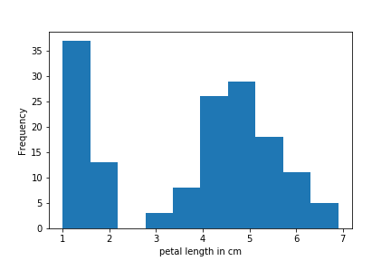
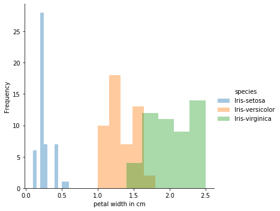
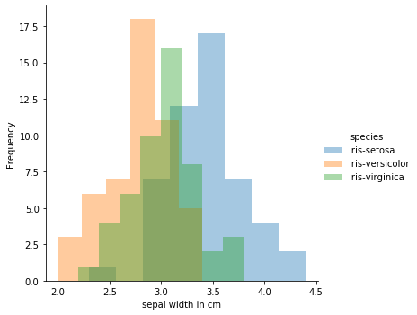

## Project Programming and scripting 2020

**Iris data summary**  
The Iris data set was introduced by British statistician Ronald Fisher. The data set consists
50 samples of three different species of Iris flowers namely Iris setosa, Iris virginica and Iris
versicolor. Each observation also has 4 features: Sepal length, Sepal width, Petal length and
Petal width. This dataset is well known and commonly used as a typical test case for many
machine learning classification problems.

**Data source**  
Iris data set was downloaded from UCI machine learning database (https://archive.ics.uci.edu/ml/machine-learning-databases/iris/) . The file 'Iris'data' is a comma separted flat file (csv). The corresponding column names are mentioned in the text file iris.names. These are sepal length in cm, sepal width in cm, petal length in cm, petal width in cm and species. 

**Running the script and output files**  
From command prompt run *“python analysis.py”*.  
This python script will save the following files to the current working directory:
- Output summary of each variable to a single file called *‘summary.txt’*
- Save histogram of each variable as png files
- Save scatter plots of each pair of variables

**Histograms using matplotlib**  
matplotlib library is used to produce the below histograms of each variable. Normally one would expect see a nearly normal distributions for samples such as length and width. However the historgrams do not resemble a Gaussian distribution. This is becuase the sample measurements are taken from 3 different species with non identical mean and standard deviation (see summary.txt) 

The seaborn library has a neat feature that allows to plot the distinct species using different colors so distribution of each species is presented nicely.  

